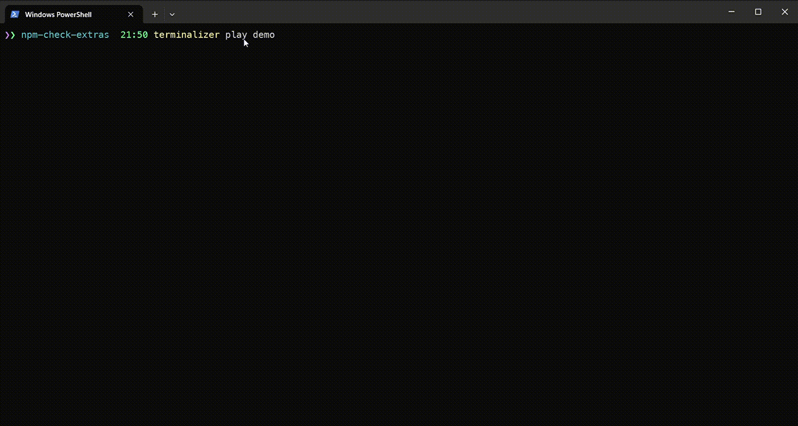
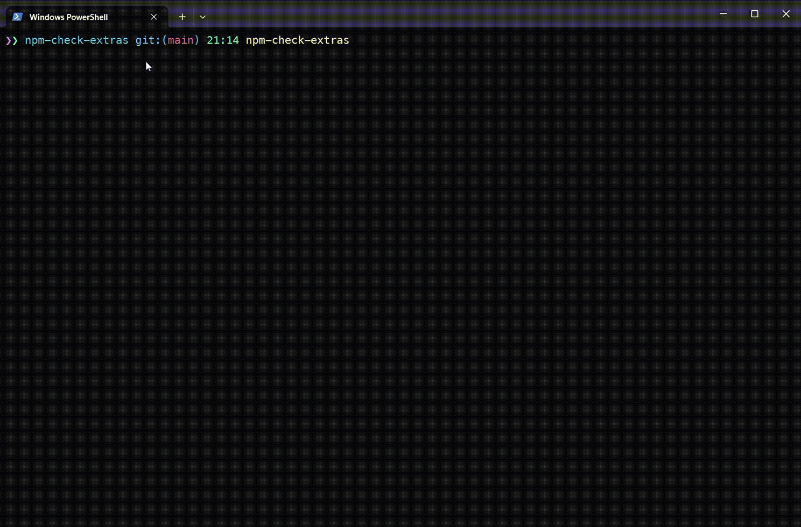
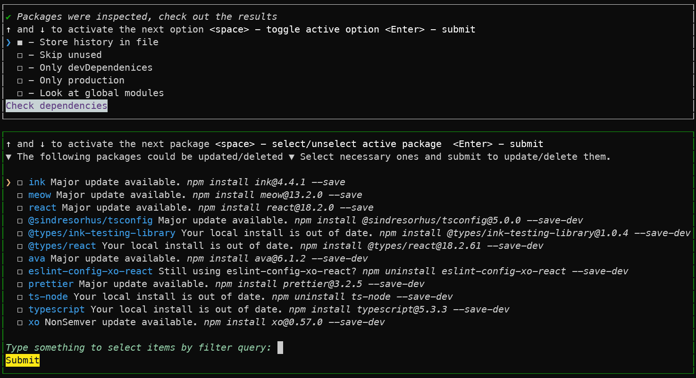
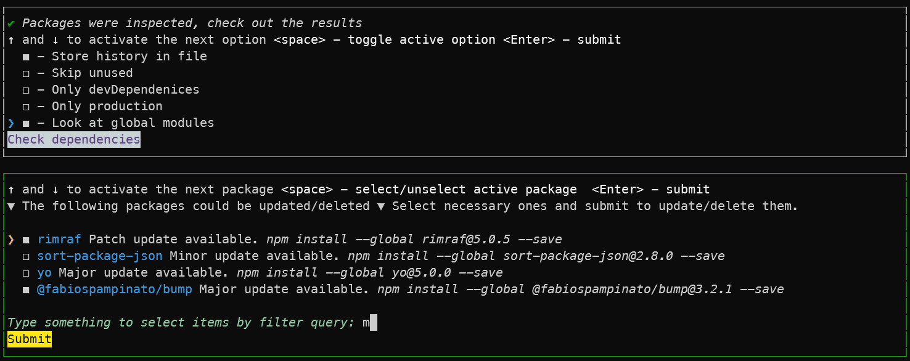
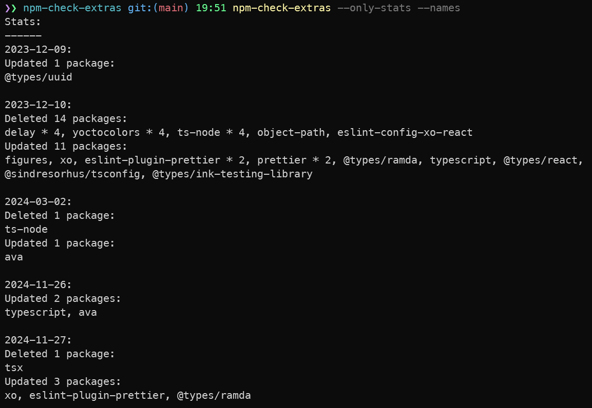

# npm-check-extras [![NPM version][npm-image]][npm-url]

> CLI app to check for outdated and unused dependencies, and run update/delete action over selected ones

## Install

```bash
$ npm install --global npm-check-extras
```

## Demos

### Basic demo



### Show history



### Displaying stats demo


## CLI

```
$ npm-check-extras --help

  CLI app to check for outdated and unused dependencies, and run update/delete action over selected ones

  Usage
    $ npm-check-extras

  Options
        --check-packages  Check packages immediately
        --production      Skip devDependencies
        --dev-only        Look at devDependencies only (skip dependencies)
        --global          Look at global modules
        --store-history   Store info about packages actions history to a file (.npm-check-history.json)
        --skip-unused     Skip check for unused packages
        --only-stats      Display only stats for updated/deleted packages and exit (it is applicable when you use --store-history option)
        --names           Show package names when --only-stats option is being used
        --date            Show stats only for specific date when --only-stats option is being used


  Examples
    $ npm-check-extras
    $ npm-check-extras --check-packages
    $ npm-check-extras --production
    $ npm-check-extras --prod
    $ npm-check-extras --check-packages --dev-only
    $ npm-check-extras --check --dev-only
    $ npm-check-extras --check --dev-only --store-history
    $ npm-check-extras --global
    $ npm-check-extras --check --global
    $ npm-check-extras -c -d
    $ npm-check-extras --skup-unused
    $ npm-check-extras --only-stats
    $ npm-check-extras --report
    $ npm-check-extras --report --names
    $ npm-check-extras --report --names --date 2024-11-27
```

## Screenshots

Checking project's dependencies.



Checking globally installed dependencies, then select packages by `m` filter.



Displaying only stats and exit by `--only-stats` or `--report` flag

> This is applicable if you use --store-history option otherwise stats could not be collected



Displaing stats using `--date` flag to show stats only for specified date


## What's under the hood?

- [npm-check](https://github.com/dylang/npm-check)
- [ink](https://github.com/vadimdemedes/ink)
- [execa](https://github.com/sindresorhus/execa)

## License

MIT © [Rushan Alyautdinov](https://github.com/akgondber)

[npm-image]: https://img.shields.io/npm/v/npm-check-extras.svg?style=flat
[npm-url]: https://npmjs.org/package/npm-check-extras
